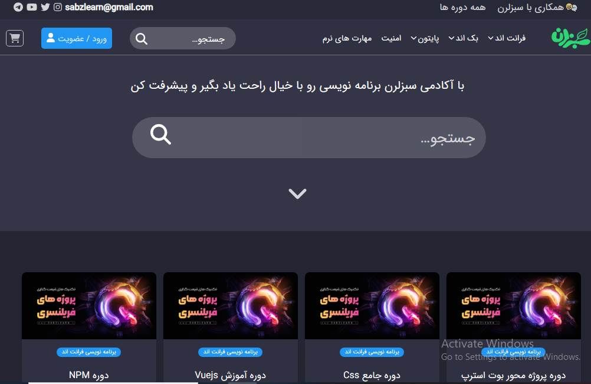
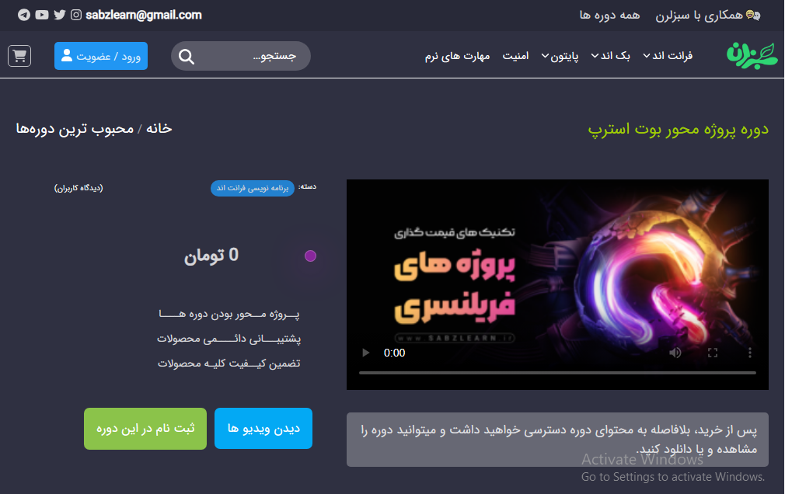

## sabzLearn Project

This is a tutorial store site that you can model for your projects

## Project characteristics

* This project has both an admin panel and a user panel


## Demo project



----




## start

In order to start this project, you must first open the backend file from your terminal with the following command :

```bash
  cd backend 
```
    
And after entering the backend folder, you must install the required packages of the project with the following command :    

```bash
  npm install
```

After installing the packages, it is time to execute the project
Do it with the command below :

```bash
  npm run dev
```

Well, the work is done
If you receive the following message, it means that the project has been successfully installed and you can enjoy the project :

```bash
  [nodemon] 2.0.20
[nodemon] to restart at any time, enter `rs`
[nodemon] watching path(s): *.*
[nodemon] watching extensions: js,mjs,json  
[nodemon] starting `node server.js`
Server running in development mode on port 4000
MongoDB Connected: 127.0.0.1
```

----


please be if you have any suggestion im happy to share it with me
